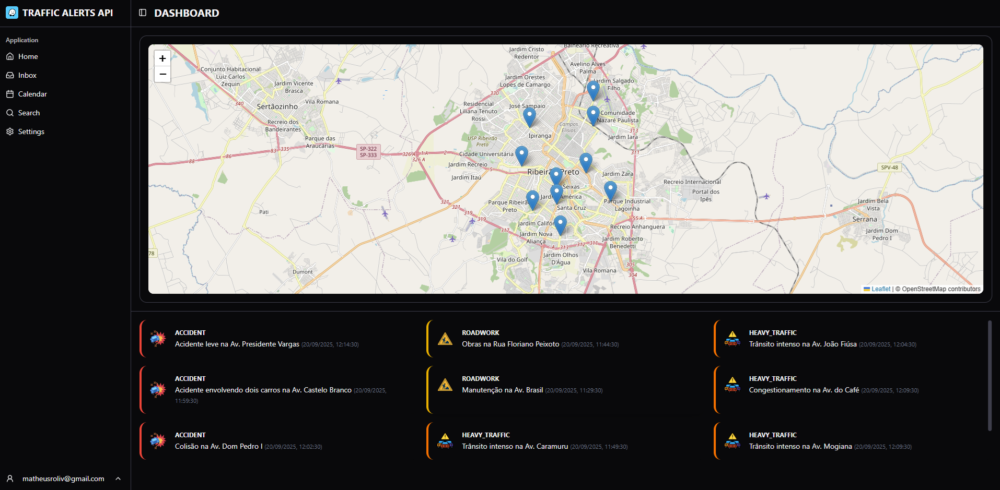

# 🚦 Traffic Alerts Dashboard

Uma interface moderna e reativa para visualização de alertas de tráfego em tempo real, construída com as mais recentes tecnologias do ecossistema Vue.js.



*<p align="center">Tela principal do dashboard, exibindo o mapa interativo e a lista de alertas.</p>*

## ✨ Funcionalidades

-   **Dashboard Interativo**: Visualize todos os alertas de tráfego em um painel centralizado e de fácil leitura.
-   **Mapa em Tempo Real**: Um mapa (Leaflet) que exibe a localização exata de cada alerta, com zoom automático para abranger todos os pontos.
-   **Atualização Automática**: A lista de alertas é atualizada automaticamente a cada 60 segundos, garantindo que você tenha sempre as informações mais recentes.
-   **Design Responsivo**: Interface totalmente adaptável para desktops, tablets e dispositivos móveis, com um sidebar colapsável.
-   **Autenticação Segura**: Sistema de login para acesso exclusivo ao dashboard.
-   **Tipagem Forte com TypeScript**: Todo o projeto é desenvolvido com TypeScript para garantir robustez, manutenibilidade e uma melhor experiência de desenvolvimento.
-   **Componentização Inteligente**: Utilização de componentes `shadcn-vue` para uma UI consistente e personalizável.

## 🛠️ Tecnologias Utilizadas

A aplicação foi construída utilizando uma stack moderna e performática, focada na melhor experiência do desenvolvedor e do usuário.

| Categoria                | Tecnologia                                                                                                                           |
| ------------------------ | ------------------------------------------------------------------------------------------------------------------------------------ |
| **Framework Principal**  | [**Vue 3**](https://vuejs.org/) (com Composition API e `<script setup>`)                                                              |
| **Build Tool**           | [**Vite**](https://vitejs.dev/)                                                                                                      |
| **Linguagem**            | [**TypeScript**](https://www.typescriptlang.org/)                                                                                    |
| **Estilização**          | [**Tailwind CSS**](https://tailwindcss.com/)                                                                                         |
| **Componentes de UI**    | [**shadcn-vue**](https://www.shadcn-vue.com/)                                                                                        |
| **Ícones**               | [**Lucide Icons**](https://lucide.dev/)                                                                                              |
| **Roteamento**           | [**Vue Router**](https://router.vuejs.org/)                                                                                          |
| **Gerenciamento de Estado** | [**Pinia**](https://pinia.vuejs.org/)                                                                                               |
| **Requisições HTTP**     | [**Axios**](https://axios-http.com/)                                                                                                 |
| **Mapa**                 | [**Leaflet**](https://leafletjs.com/)                                                                                                |

## 📂 Estrutura do Projeto

O projeto segue uma arquitetura modular e escalável, separando claramente as responsabilidades:

```
src
├── components/         # Componentes de UI globais e reutilizáveis (baseados no shadcn)
├── pages/              # Páginas da aplicação, divididas por features (auth, home)
│   ├── auth/
│   └── home/
│       ├── components/ # Componentes específicos da feature home (AppSidebar, TrafficMap)
│       ├── layouts/    # Layouts de página (AppLayout)
│       └── views/      # Componentes de visão final (DashboardPage)
├── router/             # Configuração de rotas (Vue Router)
├── services/           # Comunicação com a API (Axios)
├── stores/             # Gerenciamento de estado global (Pinia)
├── types/              # Definições de tipos e interfaces do TypeScript
└── utils/              # Funções utilitárias
```

## 🚀 Como Executar o Projeto Localmente

Siga os passos abaixo para configurar e executar o projeto no seu ambiente de desenvolvimento.

### Pré-requisitos

-   [Node.js](https://nodejs.org/en/) (versão 18 ou superior)
-   [npm](https://www.npmjs.com/) ou [yarn](https://classic.yarnpkg.com/)

### Passos

1.  **Clone o repositório:**
    ```bash
    git clone https://github.com/mrodriguesoliv/traffic-alerts-frontend.git
    ```

2.  **Acesse o diretório do projeto:**
    ```bash
    cd traffic-alerts-frontend
    ```

3.  **Instale as dependências:**
    ```bash
    npm install
    ```
    *ou, se estiver usando yarn:*
    ```bash
    yarn install
    ```

4.  **Configure as variáveis de ambiente:**
    -   Crie uma cópia do arquivo de exemplo `.env.example`:
        ```bash
        cp .env.example .env
        ```
    -   Abra o arquivo `.env` e substitua o valor de `VITE_API_BASE_URL` pela URL da sua API backend.
        ```env
        VITE_API_BASE_URL=http://localhost:3000/api
        ```

5.  **Inicie o servidor de desenvolvimento:**
    ```bash
    npm run dev
    ```

A aplicação estará disponível em `http://localhost:5173` (ou outra porta, se a 5173 estiver em uso).

## 📄 Licença

Este projeto é distribuído sob a licença MIT. Veja o arquivo `LICENSE` para mais detalhes.

---

Feito com ❤️ por **Matheus Oliveira**